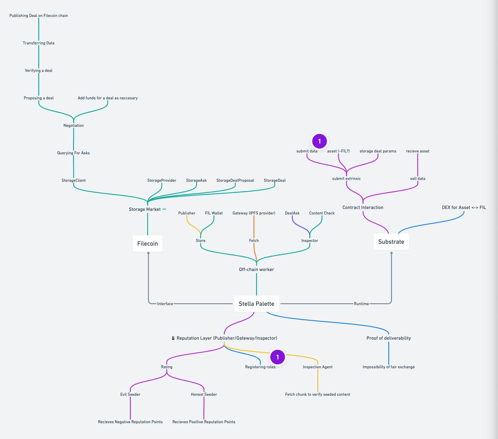

# 🧷 stella
[Substrate](substrate.dev) palett concept to connect Substrate ecosystem with [Filecoin Storage Market deals](https://filecoin-project.github.io/specs/#systems__filecoin_markets__storage_market).

* [What is a Pallet?](https://substrate.dev/docs/en/development/module/#what-is-a-pallet)
* [Learn more about Building a Custom Pallet](https://substrate.dev/docs/en/tutorials/build-a-dapp/pallet)

# High-level introduction
We see potential to connect Substrate parachains with storage level where validators does not need to do pinning (hosting) from their own pocket of resources.

### We would like to leverage here
* [Filecoin Storage Market deals](https://filecoin-project.github.io/specs/#systems__filecoin_markets__storage_market).
* [Substrate](substrate.dev)
* [paritytech/substrate-lfs](https://github.com/paritytech/substrate-lfs)
* [!ink](https://substrate.dev/docs/en/development/contracts/ink#__docusaurus)
* [Off-chain Workers](https://substrate.dev/docs/en/development/module/off-chain-workers#using-off-chain-workers-in-the-runtime)
* [KodaDot](https://twitter.com/KodaDot)

# Brief overview v0.1

## POC

1. User submits IPFS hash to Substrate node (function submitHash)

2. Off-chain worker triggers pinning the hash on IPFS

### IPFS

download ipfs from here [https://dist.ipfs.io/#go-ipfs](https://dist.ipfs.io/#go-ipfs)

[https://docs.ipfs.io/reference/api/http/](https://docs.ipfs.io/reference/api/http/)

[https://docs.ipfs.io/reference/api/http/#api-v0-pin-add](https://docs.ipfs.io/reference/api/http/#api-v0-pin-add)

~ ipfs add - how to create ipfs hash [https://docs.ipfs.io/reference/api/cli/#ipfs-add](https://docs.ipfs.io/reference/api/cli/#ipfs-add)

~ ipfs pin - [https://docs.ipfs.io/reference/api/cli/#ipfs-pin](https://docs.ipfs.io/reference/api/cli/#ipfs-pin)

~ ipfs daemon —init - [https://docs.ipfs.io/reference/api/cli/#ipfs-daemon](https://docs.ipfs.io/reference/api/cli/#ipfs-daemon)

~ ipfs daemon

### Filecoin

[https://lotu.sh/en+cli](https://lotu.sh/en+cli)

